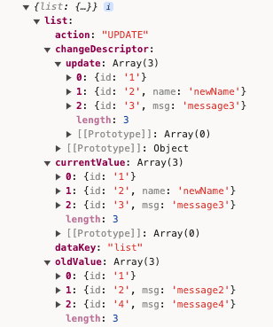

# getChangeDescriptor 获取变化的普通对象数据描述

## 说明

与 **Column** 装饰器的 `primary` 搭配使用

### getChangedDescriptor()的输出格式

- **key**（实例化属性的 key）
  - **dataKey**
    - 变化属性的 output 流向数据的 key
  - **currentValue**
    - 最新值
  - **oldValue**
    - 旧值
  - **changeDescriptor**
    - 变化的数据的描述，包括 create、update、delete
  - **action**
    - UPDATE、CREATE、DELETE

## 案例

::: tabs

@tab 案例一

### 模型

```ts :no-line-numbers
<!-- @include: ./init.ts#model -->
```

### 实例初始化

```ts :no-line-numbers
<!-- @include: ./init.ts#instance -->
```

### 修改实例

```ts :no-line-numbers
<!-- @include: ./init.ts#change -->
```

### 打印日志

```ts :no-line-numbers
<!-- @include: ./init.ts#log -->
```

:::


